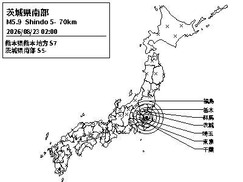
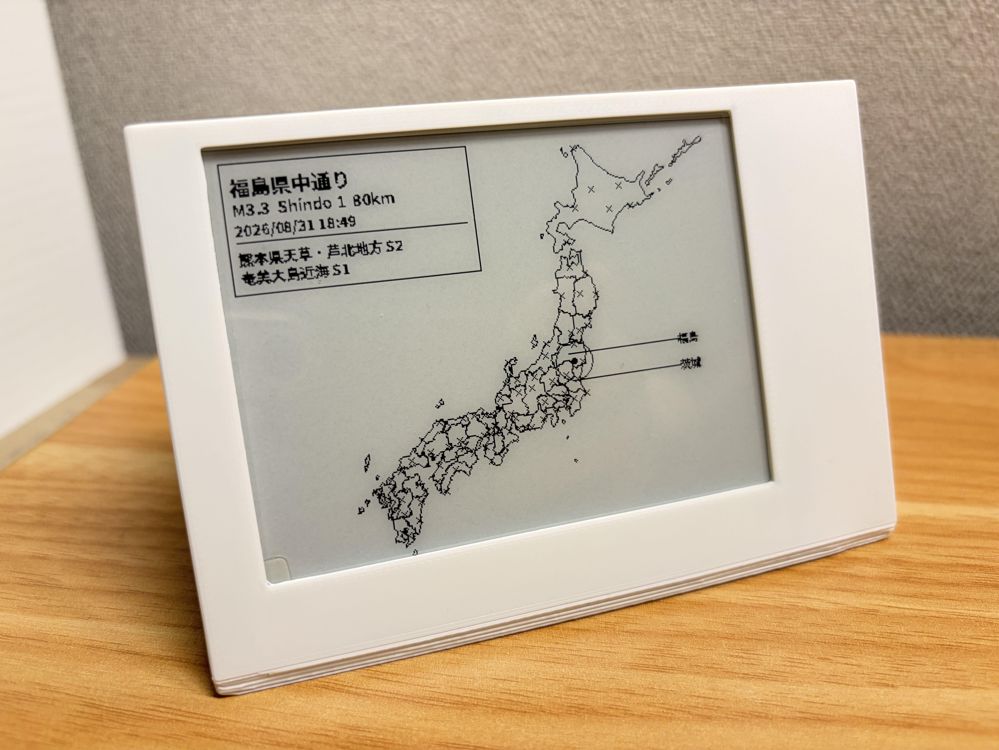

# Japan Seismic Monitor — e-paper edition

A always-on desk display that shows real earthquake activity across Japan, updating within about a second of the Japan Meteorological Agency issuing a report. It runs on a Raspberry Pi Zero WH driving a Waveshare 4.2" e-paper panel, is built to run **unattended for years**, and was designed to prioritize one thing above all: knowing about a real earthquake as fast as the hardware physically allows.




## Overview

This started as a browser-based visualization of Japan's prefectures and monitoring stations, then got rebuilt from the ground up as a native, offline-capable display for e-paper — no browser, no HTML/JS, no GUI, nothing that a Raspberry Pi Zero can't comfortably run for half a decade on a shelf.

It listens to [P2PQuake](https://www.p2pquake.net/), which relays JMA's official earthquake bulletins over a live WebSocket, and renders each new event onto a 400×300 1-bit map: the affected prefecture(s) labeled, the epicenter marked with a set of concentric rings sized to both the shindo (seismic intensity) reading and how far the felt area actually reached, and a compact info box with magnitude, depth, and a short history of recent events.

## Features

- **Live, not polled.** A persistent WebSocket connection to P2PQuake means a new event reaches the display in roughly the time it takes JMA to publish it — not on whatever polling interval seemed reasonable.
- **Partial-refresh-first.** Every event-triggered update is a fast, flash-free partial refresh. Full refreshes (needed periodically to clear e-paper ghosting) run on their own independent schedule and never compete with an urgent update for priority.
- **Built to run for years without anyone touching it** — systemd watchdog integration to catch real hangs (not just crashes), exponential backoff on every network path, hardware-fault-tolerant SPI calls, and a bounded system journal so logging can't slowly fill the SD card.
- **Tuned for a Pi Zero's actual limits.** A custom-subset, pre-instanced font (2.5MB instead of the original ~9.5MB variable font), module-level caching for everything that doesn't change between frames, and a static map layer rendered once and reused rather than redrawn on every event.
- **Reads in Japanese, laid out for a tiny monochrome panel.** Prefecture names render in compact Japanese short-form rather than English romanization, placed in the map's margins via a layout algorithm that packs labels by their actual proximity instead of forcing them apart.

## Hardware

- Raspberry Pi Zero WH (or any Pi with a 40-pin GPIO header and Wi-Fi)
- Waveshare 4.2" e-Paper Module **V2**, with partial-refresh support
- A microSD card — ideally a high-endurance one, given the multi-year runtime this is built for

## Repository layout

| Path | What it is |
|---|---|
| `render.py` | Builds one frame. Runs standalone too — `python3 render.py` writes `preview.png` so you can check the layout on any machine, no e-paper hardware required. |
| `main.py` | The long-running process for the Pi: the WebSocket connection, the fallback poll, and all the reliability hardening described below. |
| `data/` | Prefecture boundaries, the monitoring-station list, and label anchor points. |
| `fonts/NotoSansJP-Bold.ttf` | A custom-built Japanese font subset — see [Performance on a Pi Zero](#performance-on-a-pi-zero) for why it's not the stock file. |
| `seismic-epaper.service` | The systemd unit that keeps this running persistently, with watchdog and unlimited-retry configuration baked in. |
| `requirements.txt` | Python dependencies. |

## Quick start

1. Flash Raspberry Pi OS Lite, enable SSH and Wi-Fi via Raspberry Pi Imager's advanced settings, and **note the username you choose** — you'll need it in every command below.
2. SSH in, run `sudo raspi-config` → Interface Options → SPI → enable, reboot.
3. Attach the panel (HAT version plugs directly onto the GPIO header; bare-panel version needs wiring per Waveshare's 4.2" V2 wiki).
4. Clone Waveshare's driver and copy just the library folder in:
   ```bash
   git clone https://github.com/waveshareteam/e-Paper.git
   cp -r e-Paper/RaspberryPi_JetsonNano/python/lib/waveshare_epd ~/seismic-epaper/
   ```
5. Copy this project onto the Pi, then install dependencies:
   ```bash
   cd ~/seismic-epaper
   pip3 install -r requirements.txt --break-system-packages
   ```
6. Test the renderer with zero hardware risk (`python3 render.py`), then test the real panel (`python3 main.py`, Ctrl+C to stop).
7. **Before installing the service**, open `seismic-epaper.service` and confirm `User=`, `WorkingDirectory=`, and `ExecStart=` all match your actual username — not `pi`, unless that's genuinely what you set in step 1.
8. Install and start it:
   ```bash
   sudo cp seismic-epaper.service /etc/systemd/system/
   sudo systemctl daemon-reload
   sudo systemctl enable --now seismic-epaper
   ```
9. Confirm it's healthy:
   ```bash
   systemctl status seismic-epaper                        # Active: active (running)
   systemctl show seismic-epaper -p WatchdogUSec           # 3min 20s, not 0
   ```
10. Cap the journal so years of logs can't fill the SD card:
    ```bash
    sudo mkdir -p /etc/systemd/journald.conf.d
    printf '[Journal]\nSystemMaxUse=50M\n' | sudo tee /etc/systemd/journald.conf.d/seismic-epaper.conf
    sudo systemctl restart systemd-journald
    ```
11. Walk over and look at the actual panel. That's the only step that proves the SPI wiring is correct — everything above only proves the software is healthy.

## How the display is organized

- **No animation.** E-paper can't show motion, so the P-wave "ripple" is a set of static concentric rings at the epicenter — one ring per shindo point, sized so the outer ring reflects how far the felt area actually reached, not a fixed radius.
- **Only the affected prefecture(s) get labeled**, not all 46 — at 400×300 monochrome, labeling everything permanently would just be noise. Labels live in the map's margins (not hugging the coastline) via a packing algorithm that keeps genuinely nearby prefectures visually close together, rather than artificially spreading every label across the full available space.
- **Stations are plain markers.** Shindo intensity is shown once, at the epicenter — a scaled indicator at every affected station as well added clutter without adding information.

## Refresh design — tuned for "know about it immediately"

`main.py` holds a live WebSocket connection to P2PQuake, so a new event triggers a partial refresh within roughly a second of JMA issuing it — there's no polling interval to wait through. A slow fallback poll (60s) runs alongside it purely as a safety net in case the socket dies silently.

Every event-triggered push is a **partial refresh** — fast, no visible flash. Full refreshes run on their own independent clock (every 6 hours by default, via `MAINTENANCE_FULL_REFRESH_SECONDS`) and only touch the panel during otherwise-quiet time — they never compete with an urgent update for priority.

One real limitation worth knowing: partial refresh alone, run indefinitely, does accumulate some ghosting over time — a property of the panel's waveform, not something software fully avoids. The 6-hour maintenance refresh is a starting point, not a guarantee; shorten it if ghosting builds up faster than that clears it. Since maintenance refreshes are fully decoupled from events, tightening that number never costs any responsiveness during an actual earthquake.

## Performance on a Pi Zero

The Zero WH's single ARM1176JZF-S core and slow SD card make a few things worth doing that wouldn't matter on faster hardware:

- **Font: static and subset, not variable.** A variable font has to interpolate glyph outlines from variation deltas every time it's instanced — real CPU work, repeated on every render if you're not careful. `fonts/NotoSansJP-Bold.ttf` is pre-instanced to a fixed weight and subset to ~6,600 glyphs (JIS X 0208 levels 1+2, covering essentially any real Japanese place name), down from ~9.5MB to ~2.5MB. To rebuild it:
  ```bash
  pip install fonttools
  python -m fontTools.varLib.instancer NotoSansJP-Variable.ttf wght=700 -o static.ttf
  python -m fontTools.subset static.ttf --text-file=charset.txt --output-file=NotoSansJP-Bold.ttf \
      --glyph-names --layout-features='*' --notdef-glyph --notdef-outline --recommended-glyphs
  ```
- **Nothing reloads from disk per frame.** Fonts, the three JSON data files, the map projection, and the label-centroid lookup are all built once and cached at module level (`_cache` in `render.py`) rather than rebuilt on every call to `build_frame()`.
- **The static map layer renders once, not every time.** Prefecture outlines and station markers never change between frames — `get_base_map()` renders that layer once and hands back a cheap in-memory `.copy()` per frame instead of re-walking the geojson every time.
- **A pooled, retrying HTTP session**, not a fresh connection per fetch — avoids paying a TLS handshake (real CPU cost here) on every single request.
- **Pillow should install from a prebuilt wheel.** Raspberry Pi OS's `pip` defaults to [piwheels.org](https://www.piwheels.org), which publishes prebuilt armv6 wheels — if `pip3 install Pillow` starts compiling from source instead, something's overridden that default.

## Built for years of unattended operation

- **Exponential backoff everywhere** — the WebSocket reconnect loop, the fallback poll, and the startup fetch all back off (capped at 120s) instead of retrying on a fixed interval, resetting to base the moment a connection succeeds.
- **A systemd watchdog, not just crash detection.** `Type=notify` with `WatchdogSec=200`; `main.py`'s fallback-poll thread pings the watchdog every cycle. A genuine hang (not a crash) still gets caught and restarted.
- **`StartLimitIntervalSec=0`** — systemd's default is to stop restarting a service after too many failures in a short window. Disabled here, since this needs to outlive a bad week of hardware or network issues without anyone around to run `systemctl start`.
- **Every hardware call goes through `safe_hw_call()`** — a flaky SPI transaction logs and retries before being treated as a real failure; a genuine failure re-initializes the display rather than crashing the process.
- **`time.monotonic()` for every interval timer**, not `time.time()` — a Pi Zero has no battery-backed clock, and a post-boot NTP correction shouldn't be able to trigger a spurious (or indefinitely delayed) refresh.
- **A real startup retry loop** — the first fetch keeps retrying with backoff instead of giving up after one attempt.

### SD card and journal growth

The single biggest long-term failure mode on a Pi Zero isn't the code — it's the microSD card wearing out or filling up. This project writes no log files of its own (everything goes to the systemd journal), but the journal itself needs a cap:

```bash
sudo mkdir -p /etc/systemd/journald.conf.d
printf '[Journal]\nSystemMaxUse=50M\n' | sudo tee /etc/systemd/journald.conf.d/seismic-epaper.conf
sudo systemctl restart systemd-journald
```

Also worth doing: a **high-endurance microSD card**, and a **stable, adequately-rated 5V power supply** — brownouts during an SD write are a common real-world cause of card corruption on long-running Pi deployments, and are outside anything software can fix.

## Going further

`main.py` only acts on code `551` (the detailed seismic-intensity report). P2PQuake's WebSocket feed also carries code `556`, JMA's Earthquake Early Warning — that arrives *before* the detailed report, while the quake may still be shaking, and is the actual basis of Japan's real-time alert system. Extending `on_ws_message` to also render on `556` would be the next place to look for even faster alerting; the WebSocket connection is already there to build on.

## Data sources & credits

- Earthquake data: [P2PQuake](https://www.p2pquake.net/), relaying [JMA](https://www.jma.go.jp/)'s official bulletins.
- Prefecture boundaries: [dataofjapan/land](https://github.com/dataofjapan/land).
- Font: [Noto Sans JP](https://fonts.google.com/noto/specimen/Noto+Sans+JP) (OFL), subset for this project.
- Waveshare e-Paper driver: [waveshareteam/e-Paper](https://github.com/waveshareteam/e-Paper).
